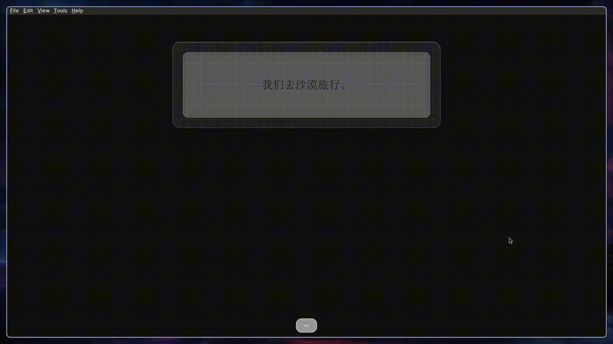
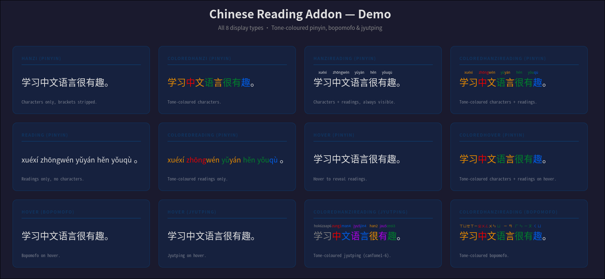
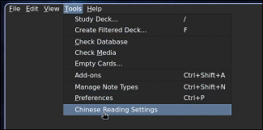
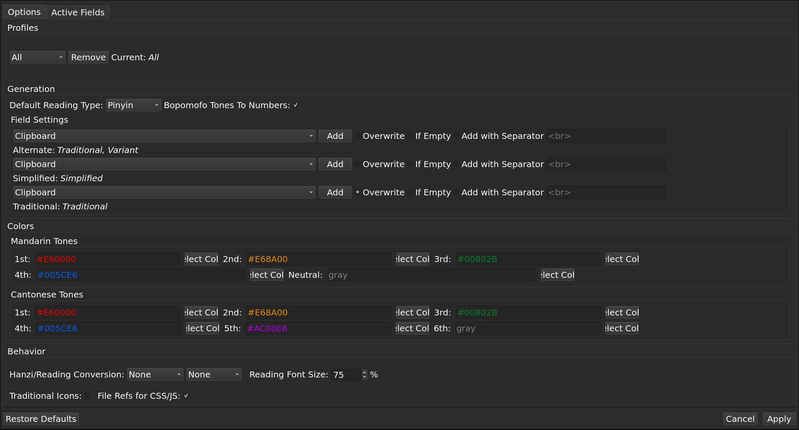
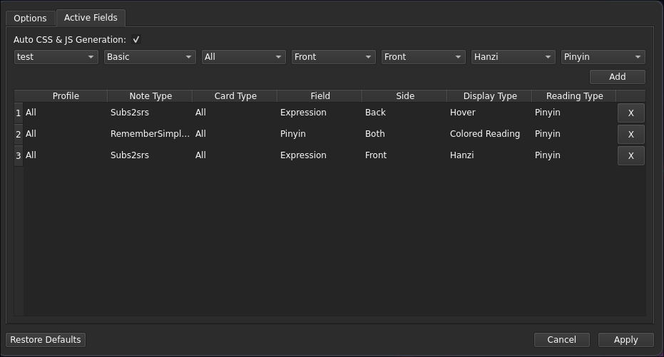

<h2 align="center">Chinese Reading Addon</h2>

<p align="center">
<a title="Rate on AnkiWeb" href="https://ankiweb.net/shared/info/429826592"></a>
<a title="License: GNU AGPLv3" href="LICENSE"></a>
<br>

> An Anki add-on for Chinese learners. Generates tone-coloured readings (pinyin, bopomofo, jyutping), simplified/traditional variants, and injects CSS/JS into card templates.

<p align="center">
  
</p>
---

## Features

- **Tone-coloured readings**: Pinyin, Bopomofo, and Jyutping with configurable tone colours
- **Simplified/Traditional variants**: Auto-generate character variants via the browser
- **Card template injection**: Auto-injects CSS and JavaScript into card templates for tone colouring
- **Active Fields system**: Configure which note types, card types, fields, and card sides get processed
- **Masked Hanzi mode**: Display readings while hiding the original characters
- **Exportable configuration**: Supports profiles for different reading workflows

<p align="center">
  
</p>

## Configuration

Access settings via **Tools → Chinese Reading Settings** or through Anki's add-on config editor.

<p align="center">
  
</p>

<p align="center">
  
</p>

### Active Fields

Configure processing rules per note type/card type/field/side via the **Active Fields** tab. 

- `display_type`: one of the 8 display types
- `note_type`, `card_type`, `field`: target identifiers
- `side`: `front` or `back`, or `all`
- `reading_type`: `pinyin`, `bopomofo`, or `jyutping`

<p align="center">
  
</p>

### File References Mode

When enabled, CSS/JS are written to `collection.media/` as standalone files referenced via `<link>`/`<script src>` instead of inline.

## Development

```bash
uv venv --python /usr/bin/python3.14 .venv
source .venv/bin/activate
uv sync

# Run checks
python dev.py lint        # ruff linter
python dev.py typecheck   # ty type checker
python dev.py test-unit   # fast unit tests (no Anki)
python dev.py test        # full test suite (needs Anki)
python dev.py build       # .ankiaddon package
python dev.py ci          # full CI pipeline
```

## License

GNU AGPLv3 — see [LICENSE](LICENSE).
