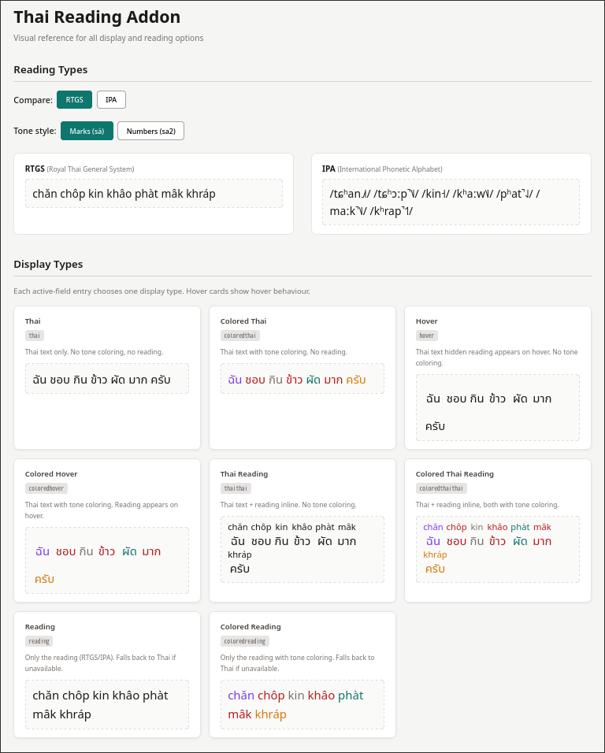

<div align="center">
  <h1 style="font-family: system-ui, -apple-system, sans-serif;">Thai Reading Addon</h1>
  <p style="color: #78716c; font-size: 1.05rem; max-width: 600px; margin: 0 auto;">
    An Anki add-on for Thai learners — generates tone-coloured readings (RTGS / IPA / Paiboon) and injects CSS/JS into card templates.
  </p>
  <br>
  <p>
    <a href="https://ankiweb.net/shared/info/2062807229"></a>
    <a href="LICENSE"></a>
  </p>
</div>

---

## Features

<div style="display: grid; grid-template-columns: 1fr 1fr; gap: 12px; margin: 16px 0;">
  <div style="border: 1px solid #e7e5e4; border-radius: 10px; padding: 16px 20px; background: #fff;">
    <strong style="color: #44403c;">🎨 Tone-coloured readings</strong><br>
    <span style="color: #78716c; font-size: 0.9rem;">RTGS, IPA, and Paiboon with 5 configurable Thai tone colours</span>
  </div>
  <div style="border: 1px solid #e7e5e4; border-radius: 10px; padding: 16px 20px; background: #fff;">
    <strong style="color: #44403c;">📦 Template injection</strong><br>
    <span style="color: #78716c; font-size: 0.9rem;">Auto-injects CSS and JavaScript into card templates for tone colouring</span>
  </div>
  <div style="border: 1px solid #e7e5e4; border-radius: 10px; padding: 16px 20px; background: #fff;">
    <strong style="color: #44403c;">⚙️ Active Fields system</strong><br>
    <span style="color: #78716c; font-size: 0.9rem;">Configure which note types, card types, fields, and sides get processed</span>
  </div>
  <div style="border: 1px solid #e7e5e4; border-radius: 10px; padding: 16px 20px; background: #fff;">
    <strong style="color: #44403c;">🔍 Segment & lookup</strong><br>
    <span style="color: #78716c; font-size: 0.9rem;">Greedy-lookahead tokenization for dictionary matching</span>
  </div>
</div>

---

## Reading Systems

<div style="display: flex; gap: 20px; flex-wrap: wrap; margin: 16px 0;">
  <div style="flex: 1; min-width: 250px; background: #fff; border: 1px solid #e7e5e4; border-radius: 10px; padding: 16px 20px;">
    <h3 style="margin: 0 0 4px 0; font-size: 0.95rem;">RTGS <span style="font-weight:400;font-size:0.8rem;color:#78716c;">(Royal Thai General System)</span></h3>
    <div style="font-size: 1.3rem; padding: 8px 12px; background: #fafaf9; border: 1px dashed #d6d3d1; border-radius: 6px; margin-top: 8px;">chan5 chop3 kin1 khao3 phat2 mak3 khrap4</div>
    <p style="font-size:0.85rem; color:#78716c; margin: 8px 0 0;">Official Thai romanization. Each syllable carries a trailing tone digit (1–5).</p>
  </div>
  <div style="flex: 1; min-width: 250px; background: #fff; border: 1px solid #e7e5e4; border-radius: 10px; padding: 16px 20px;">
    <h3 style="margin: 0 0 4px 0; font-size: 0.95rem;">IPA <span style="font-weight:400;font-size:0.8rem;color:#78716c;">(International Phonetic Alphabet)</span></h3>
    <div style="font-size: 1.1rem; padding: 8px 12px; background: #fafaf9; border: 1px dashed #d6d3d1; border-radius: 6px; margin-top: 8px;">/tɕʰan˩˩˦ tɕʰɔːp̚˥˩ kin˧ kʰaːw˥˩ pʰat̚˨˩ maːk̚˥˩ kʰrap̚˦˥/</div>
    <p style="font-size:0.85rem; color:#78716c; margin: 8px 0 0;">Precise phonetic transcription with tone letters.</p>
  </div>
  <div style="flex: 1; min-width: 250px; background: #fff; border: 1px solid #e7e5e4; border-radius: 10px; padding: 16px 20px;">
    <h3 style="margin: 0 0 4px 0; font-size: 0.95rem;">Paiboon <span style="font-weight:400;font-size:0.8rem;color:#78716c;">(learner-friendly)</span></h3>
    <div style="font-size: 1.3rem; padding: 8px 12px; background: #fafaf9; border: 1px dashed #d6d3d1; border-radius: 6px; margin-top: 8px;">chǎn chɔ̂ɔp gin kâao pàt mâak kráp</div>
    <p style="font-size:0.85rem; color:#78716c; margin: 8px 0 0;">Tone diacritics on vowels, doubled for length.</p>
  </div>
</div>

The default reading system is **RTGS**. The active field configuration lets you choose a different reading type per note/card field.

### RTGS Tone Display

The addon's dictionary stores RTGS readings in a digit-suffix format (`sa2 wat2 di1`), where each digit maps to a Thai tone class. Readings can be displayed in two styles:

<div style="display: flex; gap: 20px; flex-wrap: wrap; margin: 16px 0;">
  <div style="flex: 1; min-width: 250px; background: #fff; border: 1px solid #e7e5e4; border-radius: 10px; padding: 16px 20px;">
    <div style="display: inline-block; font-size: 0.7rem; font-family: monospace; background: #e7e5e4; padding: 2px 7px; border-radius: 4px; color: #57534e;">marks</div>
    <h3 style="margin: 6px 0; font-size: 0.95rem;">Marks (default)</h3>
    <div style="font-size: 1.3rem; padding: 8px 12px; background: #fafaf9; border: 1px dashed #d6d3d1; border-radius: 6px;">chǎn chóp kin khâao phàt mâak khráp</div>
    <p style="font-size:0.85rem; color:#78716c; margin: 8px 0 0;">Digits replaced with conventional tone diacritics on the syllable's vowel.</p>
  </div>
  <div style="flex: 1; min-width: 250px; background: #fff; border: 1px solid #e7e5e4; border-radius: 10px; padding: 16px 20px;">
    <div style="display: inline-block; font-size: 0.7rem; font-family: monospace; background: #e7e5e4; padding: 2px 7px; border-radius: 4px; color: #57534e;">numbers</div>
    <h3 style="margin: 6px 0; font-size: 0.95rem;">Numbers</h3>
    <div style="font-size: 1.3rem; padding: 8px 12px; background: #fafaf9; border: 1px dashed #d6d3d1; border-radius: 6px;">chan5 chop3 kin1 khao3 phat2 mak3 khrap4</div>
    <p style="font-size:0.85rem; color:#78716c; margin: 8px 0 0;">Raw digit suffix per syllable, as stored in the dictionary.</p>
  </div>
</div>

Tone colours always work from the underlying tone number regardless of which reading system or display style is selected. Switch between RTGS styles via **Tools → Thai Reading Settings → RTGS Tone Style**.

---

## Visual Reference

A demo page showing all display types, reading types, and tone colours is available in [`demo/index.html`](demo/index.html).



---

## Configuration

Access settings via **Tools → Thai Reading Settings** or through Anki's add-on config editor.

<table style="width: 100%; border-collapse: collapse; font-size: 0.85rem; background: #fff; border-radius: 8px; overflow: hidden; border: 1px solid #e7e5e4;">
  <thead>
    <tr style="background: #e7e5e4; text-align: left;">
      <th style="padding: 8px 12px; font-weight: 600;">Key</th>
      <th style="padding: 8px 12px; font-weight: 600;">Type</th>
      <th style="padding: 8px 12px; font-weight: 600;">Default</th>
      <th style="padding: 8px 12px; font-weight: 600;">Description</th>
    </tr>
  </thead>
  <tbody>
    <tr style="border-top: 1px solid #f0efed;"><td style="padding: 6px 12px;"><code>ReadingType</code></td><td style="padding: 6px 12px;"><code>"rtgs"</code> | <code>"ipa"</code> | <code>"phonetics"</code></td><td style="padding: 6px 12px;"><code>"rtgs"</code></td><td style="padding: 6px 12px;">Default reading system</td></tr>
    <tr style="border-top: 1px solid #f0efed;"><td style="padding: 6px 12px;"><code>FontSize</code></td><td style="padding: 6px 12px;"><code>int</code> (1–200)</td><td style="padding: 6px 12px;"><code>75</code></td><td style="padding: 6px 12px;">Reading font size as % of base text</td></tr>
    <tr style="border-top: 1px solid #f0efed;"><td style="padding: 6px 12px;"><code>ThaiTones</code></td><td style="padding: 6px 12px;"><code>[str; 5]</code></td><td style="padding: 6px 12px;"><code>["#78716C","#0F766E","#B91C1C","#D97706","#7C3AED"]</code></td><td style="padding: 6px 12px;">Colours for tones 1–5 (Mid, Low, Falling, High, Rising)</td></tr>
    <tr style="border-top: 1px solid #f0efed;"><td style="padding: 6px 12px;"><code>RtgsToneStyle</code></td><td style="padding: 6px 12px;"><code>"marks"</code> | <code>"numbers"</code></td><td style="padding: 6px 12px;"><code>"marks"</code></td><td style="padding: 6px 12px;">Tone marks on vowels (<code>sà</code>) or digit suffix (<code>sa2</code>)</td></tr>
    <tr style="border-top: 1px solid #f0efed;"><td style="padding: 6px 12px;"><code>AutoCssJsGeneration</code></td><td style="padding: 6px 12px;"><code>bool</code></td><td style="padding: 6px 12px;"><code>true</code></td><td style="padding: 6px 12px;">Auto-inject CSS/JS into card templates</td></tr>
    <tr style="border-top: 1px solid #f0efed;"><td style="padding: 6px 12px;"><code>ShortcutKey</code></td><td style="padding: 6px 12px;"><code>str</code></td><td style="padding: 6px 12px;"><code>"F9"</code></td><td style="padding: 6px 12px;">Keyboard shortcut for toggle reading (set <code>""</code> to disable)</td></tr>
    <tr style="border-top: 1px solid #f0efed;"><td style="padding: 6px 12px;"><code>Profiles</code></td><td style="padding: 6px 12px;"><code>[str]</code></td><td style="padding: 6px 12px;"><code>["all"]</code></td><td style="padding: 6px 12px;">Anki profiles the addon is active on</td></tr>
    <tr style="border-top: 1px solid #f0efed;"><td style="padding: 6px 12px;"><code>UseFileReferences</code></td><td style="padding: 6px 12px;"><code>bool</code></td><td style="padding: 6px 12px;"><code>false</code></td><td style="padding: 6px 12px;">Write CSS/JS as standalone files in collection.media</td></tr>
    <tr style="border-top: 1px solid #f0efed;"><td style="padding: 6px 12px;"><code>ActiveFields</code></td><td style="padding: 6px 12px;"><code>[str]</code></td><td style="padding: 6px 12px;"><code>[]</code></td><td style="padding: 6px 12px;">Entries: <code>display;profile;noteType;cardType;field;side;readingType</code></td></tr>
  </tbody>
</table>

---

## Dependencies

### Pronunciation dictionary

These populate `db/thai_dict.sqlite`:

| Dependency | Role |
|---|---|
| [`thaiphon`](https://pypi.org/project/thaiphon/) ≥0.6.0 | Thai phonetic transcription engine — RTGS and IPA rendering, syllable analysis, tone detection |
| [`thaiphon-data-volubilis`](https://pypi.org/project/thaiphon-data-volubilis/) ≥0.2.0 | ~84k word Thai pronunciation lexicon (optional but recommended) |

Run `uv run python db/populate_dict.py` to build the dictionary.

### Runtime

No additional pip dependencies. Uses `PyQt6`, `aqt`, and `anki` provided by the Anki environment.

### Development tooling

| Tool | Purpose |
|---|---|
| `ruff` | Linter and formatter |
| `pytest` | Unit test runner |
| `pytest-anki2` | Integration test fixtures |
| `ty` | Static type checker |

---

## Development

```bash
uv venv .venv
source .venv/bin/activate
uv sync

# Populate pronunciation dictionary
uv run python db/populate_dict.py

# Run checks
python dev.py lint        # ruff linter
python dev.py typecheck   # ty type checker
python dev.py test-unit   # fast unit tests (no Anki)
python dev.py test        # full test suite (needs Anki)
python dev.py build       # .ankiaddon package
python dev.py ci          # full CI pipeline
```

---

## License

GNU AGPLv3 — see [LICENSE](LICENSE).
